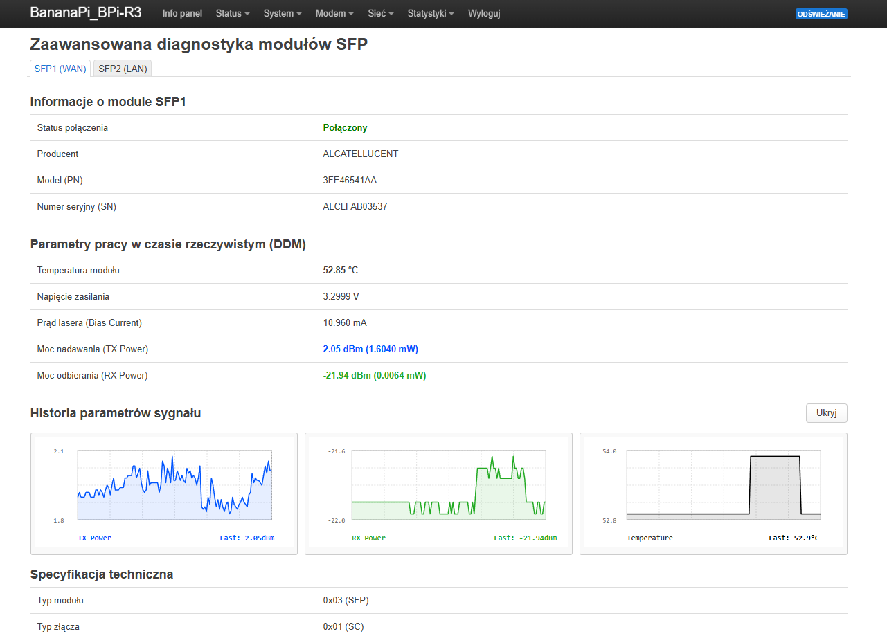
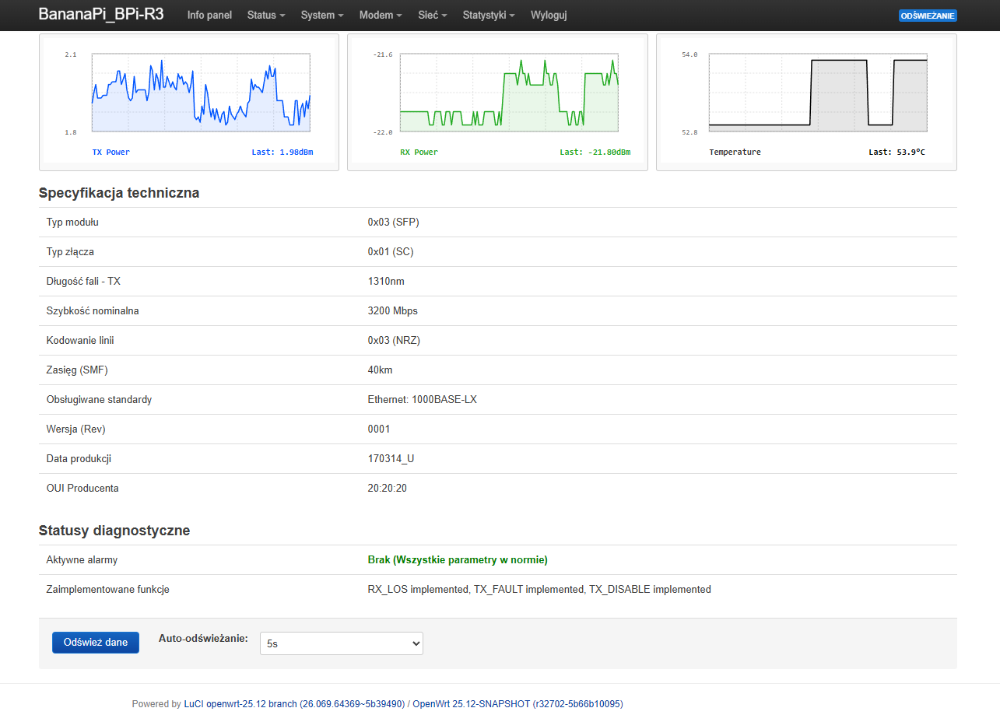
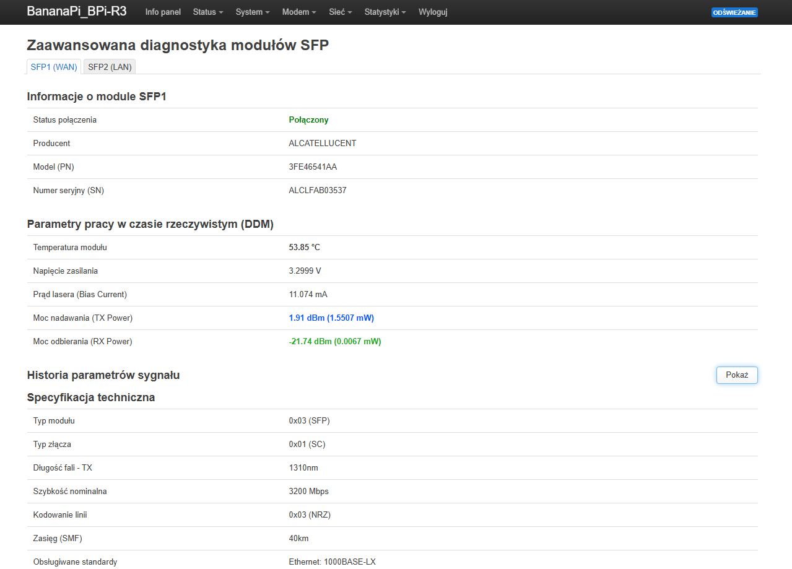
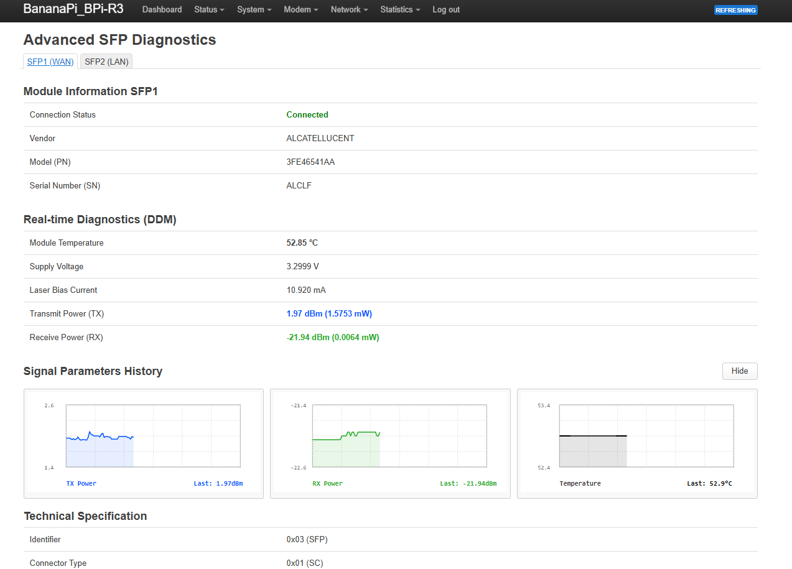

# SFP Diagnostics for LuCI

Rozszerzenie LuCI dla OpenWrt 25.12 przeznaczone dla Banana Pi BPi-R3. Dodaje stronę diagnostyczną dla modułów SFP1 (WAN) i SFP2 (LAN), wykorzystując dane DDM odczytywane przez `ethtool -m`.

## Funkcje

- status linku dla obu interfejsów SFP,
- producent, numer katalogowy, numer seryjny i dane identyfikacyjne modułu,
- temperatura, napięcie, prąd bias oraz moc TX/RX w dBm i mW,
- długość fali, bitrate, kodowanie, zasięg SMF i obsługiwane standardy,
- aktywne alarmy i zaimplementowane opcje modułu,
- historia temperatury oraz mocy TX/RX z wykresami w bieżącej sesji LuCI,
- ręczne i automatyczne odświeżanie danych,
- tłumaczenie interfejsu na język angielski.

## Wersja v4

Wersja v4 jest przepisana z wcześniejszej wersji Lua do JavaScript. Backend korzysta z tekstowego wyjścia `ethtool -m`, więc działa z oficjalnymi wersjami `ethtool` bez konieczności stosowania patcha JSON. Parser przetwarza między innymi dane producenta, parametry DDM, długości światłowodu, opcje oraz alarmy.

Historia projektu:

- v1: wcześniejsza wersja Lua dla OpenWrt 23.05,
- v2: wersja JavaScript wymagająca `ethtool --json -m`,
- v3: parser tekstowego wyjścia `ethtool -m` i tłumaczenie angielskie,
- v4: wykresy TX/RX/temperatury oraz dalsze poprawki obsługi różnych modułów SFP.

## Wymagania

- Banana Pi BPi-R3 z OpenWrt 25.12,
- pakiety `rpcd-mod-ucode`, `luci-mod-admin-full` i `libc`,
- dostępne polecenie `ethtool` z obsługą `ethtool -m`,
- zamontowany debugfs (`/sys/kernel/debug`),
- interfejsy nazwane `sfp1` i `sfp2`.

Sprawdzenie środowiska:

```sh
which ethtool
ethtool -m sfp1
ip link show sfp1
mount | grep debugfs
```

## Instalacja APK

Dla OpenWrt 25.12 można użyć gotowego pakietu APK dla BPi-R3. Pakiet zawiera ten sam widok JavaScript i backend RPCD, które są obecne w tym repozytorium.

```sh
apk update
apk add rpcd-mod-ucode luci-mod-admin-full libc
cd /tmp
wget https://dl.eko.one.pl/test/sfp-diagnostics-luci-js-4-r1.apk
apk add --allow-untrusted /tmp/sfp-diagnostics-luci-js-4-r1.apk
apk add ethtool-full
rm -rf /tmp/luci-modulecache
/etc/init.d/rpcd restart
```

Po instalacji strona jest dostępna w **LuCI -> Network -> SFP** (lub **LuCI -> Sieć -> SFP**).

## Pobieranie

Gotowy pakiet v4 dla Banana Pi BPi-R3 jest dostępny z dwóch mirrorów:

| Plik | Mirror 1 | Mirror 2 |
| --- | --- | --- |
| `sfp-diagnostics-luci-js-4-r1.apk` | [sfp-diagnostics-luci-js-4-r1.apk](https://dl.eko.one.pl/test/sfp-diagnostics-luci-js-4-r1.apk) | [sfp-diagnostics-luci-js-4-r1.apk](https://ns3274274.ip-5-39-87.eu/sfp/apk/sfp-diagnostics-luci-js-4-r1.apk) |

Opcjonalny, patchowany `ethtool 6.3` dla BPi-R3, z obsługą `ethtool --json -m`, również ma dwa mirrory:

| Plik | Mirror 1 | Mirror 2 |
| --- | --- | --- |
| `ethtool-full-bin-6.3-r1.apk` | [ethtool-full-bin-6.3-r1.apk](https://dl.eko.one.pl/test/ethtool-full-bin-6.3-r1.apk) | [ethtool-full-bin-6.3-r1.apk](https://ns3274274.ip-5-39-87.eu/sfp/apk/ethtool-full-bin-6.3-r1.apk) |

## Budowanie z feeda OpenWrt

Repozytorium zawiera definicję pakietu w katalogu `sfp-diagnostics-luci-js/Makefile`, dlatego można dodać je bezpośrednio jako własny feed do drzewa OpenWrt 25.12.

W pliku `feeds.conf` albo `feeds.conf.default` dodaj:

```text
src-git sfp https://github.com/Payti/sfp-diagnostics-luci-js.git
```

Następnie w głównym katalogu źródeł OpenWrt wykonaj:

```sh
./scripts/feeds update sfp
./scripts/feeds install sfp-diagnostics-luci-js
make menuconfig
```

W `menuconfig` wybierz **LuCI -> Applications -> sfp-diagnostics-luci-js** jako `M` albo `[*]`, a potem uruchom kompilację:

```sh
make defconfig
make package/sfp-diagnostics-luci-js/compile V=s
```

Gotowy pakiet APK znajdzie się w katalogu `bin/packages/` dla wybranej architektury. Można go wyszukać poleceniem:

```sh
find bin/packages -type f -name 'sfp-diagnostics-luci-js*.apk'
```

Makefile automatycznie deklaruje zależności `rpcd-mod-ucode`, `luci-mod-admin-full`, `libc` i `ethtool-full`. Domyślnie pobierany jest oficjalny kod tego repozytorium z przypiętego commita, a wynikowy pakiet zawiera backend RPCD, ACL, wpis menu, konfigurację i widok JavaScript.

### Opcjonalny ethtool 6.3

Standardowy `ethtool-full` z repozytorium OpenWrt wystarcza do wersji v4, ponieważ parser używa tekstowego outputu. Opcjonalnie można użyć patchowanego `ethtool 6.3`, który udostępnia także `ethtool --json -m` i może pokazywać więcej informacji dla wybranych modułów. Przed instalacją pobierz plik `ethtool-full-bin-6.3-r1.apk` z jednego z dwóch mirrorów powyżej i skopiuj go do `/tmp`.

```sh
apk del ethtool-full
apk del ethtool
apk add --allow-untrusted /tmp/ethtool-full-bin-6.3-r1.apk
```

Nie należy instalować obu wariantów jednocześnie. Wersja patchowana jest przeznaczona dla BPi-R3 i nie jest wymagana przez parser znajdujący się w tym repozytorium.

## Instalacja

Repozytorium zawiera pliki w układzie odpowiadającym głównemu katalogowi systemu OpenWrt. W katalogu projektu wykonaj:

```sh
scp -r etc usr root@ADRES_ROUTERA:/tmp/sfp-diagnostics-luci-js/
scp -r www root@ADRES_ROUTERA:/tmp/sfp-diagnostics-luci-js/
ssh root@ADRES_ROUTERA
cd /tmp/sfp-diagnostics-luci-js
cp -a etc usr www /
chmod 755 /usr/libexec/rpcd/sfp
/etc/init.d/rpcd restart
rm -rf /tmp/luci-indexcache
```

Następnie otwórz LuCI i przejdź do **Network -> SFP**. W razie potrzeby wyloguj się i zaloguj ponownie, aby odświeżyć uprawnienia ACL.

## Instalacja bezpośrednio z lokalnego katalogu

Jeśli pliki zostały skopiowane do `/tmp/sfp-diagnostics-luci-js`, można użyć:

```sh
cp -a /tmp/sfp-diagnostics-luci-js/etc /tmp/sfp-diagnostics-luci-js/usr /tmp/sfp-diagnostics-luci-js/www /
chmod 755 /usr/libexec/rpcd/sfp
/etc/init.d/rpcd restart
rm -rf /tmp/luci-indexcache
```

## Sprawdzenie RPCD

Backend udostępnia metodę `status` obiektu UBus `sfp`:

```sh
ubus -v list sfp
echo '{"interface":"sfp1"}' | /usr/libexec/rpcd/sfp call status
```

Puste dane `ethtool` są zwracane jako `{}`. Oznacza to zwykle brak modułu, brak obsługi odczytu EEPROM albo nieprawidłową nazwę interfejsu.

## Screenshoty

Screeny pochodzą z testów na Banana Pi BPi-R3 z OpenWrt 25.12:

| SFP1: DDM i wykresy | SFP1: specyfikacja |
| --- | --- |
|  |  |

| SFP1: ukryte wykresy | English UI |
| --- | --- |
|  |  |

| SFP2: brak modułu |
| --- |
|  |

## Kompatybilność i konfiguracja

Pakiet został przetestowany na Banana Pi BPi-R3 z OpenWrt 25.12. W przypadku innego routera należy dopasować `/etc/sfp.json` do nazw interfejsów i ścieżek debugfs danego urządzenia. Przykładowa konfiguracja w tym repozytorium definiuje `sfp1` i `sfp2`:

```json
{
	"sfp": {
		"sfp1": { "debugfs": "/sys/kernel/debug/sfp-1/" },
		"sfp2": { "debugfs": "/sys/kernel/debug/sfp-2/" }
	}
}
```

Źródło dodatkowych informacji, wyników testów i historii projektu: [wpis na forum eko.one.pl](https://eko.one.pl/forum/viewtopic.php?pid=330336#p330336).

## Struktura

```text
etc/sfp.json                              konfiguracja ścieżek debugfs
usr/libexec/rpcd/sfp                      backend RPCD/UBus
usr/share/luci/menu.d/...                 wpis menu LuCI
usr/share/rpcd/acl.d/...                  uprawnienia ACL
www/luci-static/resources/view/network/sfp.js  widok LuCI
```

## Uwagi

Historia wykresów jest przechowywana w `sessionStorage` przeglądarki i jest ograniczona do 120 pomiarów na interfejs. Dane zależą od formatu wyjścia `ethtool`; różnice między sterownikami lub modułami mogą wymagać dostosowania parsera w `usr/libexec/rpcd/sfp`.

## Licencja

Brak licencji nie został zadeklarowany. Przed publicznym wykorzystaniem projektu dodaj licencję odpowiednią do planowanego sposobu dystrybucji.
